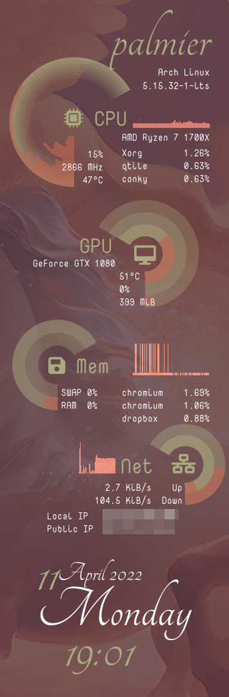

Conky-Gyre
==========

Requirements:
-------------
  * `conky`
  * `curl`
  * `lua`
  * `nvidia` graphics card driver
  * `python` version >= 3.8, with `yaml` package installed (e.g., with `pip install yaml`)
  * fonts (recommended):
      * `Nova Mono`, download from [fonts.google.com](https://fonts.google.com/specimen/Nova+Mono)
      * `Tangerine`, download from [fonts.google.com](https://fonts.google.com/specimen/Tangerine)
      * `Font Awesome 6 Free`, download from [fontawesome.com](https://fontawesome.com/download) or through your package manager

To use:
-------
  * Update `settings_gyre.yaml` to your preferred settings.
    * Confirm that `system.path` points to the correct directory.
    * Set system variables e.g., `cpu.n_cpus`, `gpu.mem`, and `net.device`.
    * Tweak positioning, colors, fonts, etc.
  * Run `./make_theme.py` to generate `conky_gyre.conkyrc` and `conky_gyre.lua`. (`./make_theme.py -h` for full usage options.)
  * `conky -qdc conky_gyre.conkyrc`

Brief settings overview:
------------------------
For `cpu`/`gpu`/`mem`/`net`,

  * `icon` is the literal FontAwesome icon that you want displayed in the rings
  * `position` describes the `x`-`y` coordinates of the center of the rings. The origin (0, 0) will be where you set `placement.alignment`. Best practice is to lock in your font choices and *then* adjust positions.
  * `radius.small` affects the size of the "hole" in the rings.
  * `radius.large` affects the overall size of the rings.
